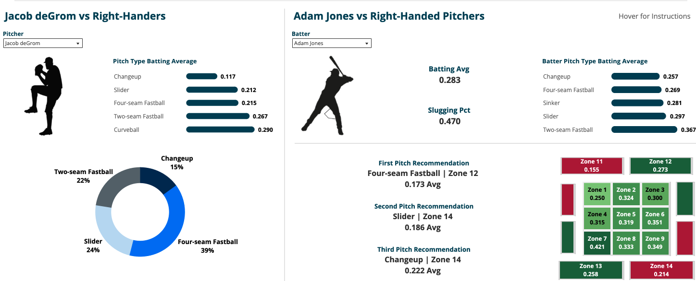

# Data-Driven Pitch Optimization

## Interactive Baseball Analytics Decision Support Tool

## Overview

This project develops a data-driven decision support tool that recommends optimal pitch types and locations for specific pitcher-batter matchups. Using historical MLB pitch and player data, machine learning techniques, and interactive visualization, the tools transforms large volume of pitch-level data into actionable insights for coaches, players, and analysts.

Users can select a pitcher and batter to receive personalized pitch recommendations along with the expected batting average associated with each recommendation.

## Business Problem

Modern baseball organizations collect millions of pitch-level observations, but converting that data into practical game strategy can be challenging.

The goal of this project was to build and interactive analytics tool that identifies the pitch characteristics and strike zone locations that are most effective against individual batters, allowing users to make informed, data-driven decisions during game preparation and execution.

## Technologies

- Python
- Pandas
- Scikit-learn
- K-Means Clustering
- Tableau

## Methodology

This project follows an end-to-end analytics workflow:

- Clean and integrate multiple public MLB datasets
- Engineer features describing pitch speed, movement, spin rate, and location
- Apply K-Means clustering to group similar pitches
- Evaluate batter performance against each pitch cluster
- Present recommendations through an interactive Tableau dashboard

## Dashboard Features

- Interactive pitcher & batter selection
- Pitch type & location recommendations
- Strike zone heat map
- Pitcher & batter summary statistics
- Breakdown of pitch type frequency for the selected pitcher
- Expected batting average for each recommendation

## My Contributions

This project was completed as part of a team in Georgia Tech's M.S. in Analytics program.

My primary contributions included:

- Data cleaning & preparation
- Dataset integration & joining
- Python-based modeling & analysis
- Dashboard visualization design
- Report development & documentation

## Repository Contents

- dashboard.png: Screenshot of the interactive Tableau dashboard
- project_report.pdf: Detailed project report
- pitch_optimization.py: Python source code
- pitch_optimization_dashboard.twb: Tableau workbook

## Dataset

This project used publicly available MLB pitch-level and player data obtained from Kaggle.

The original datasets are not included in this repository due to their size.

## Skills Demonstrated

- Data cleaning
- Data integration
- Feature engineering
- Machine learning
- Clustering analysis
- Data visualization
